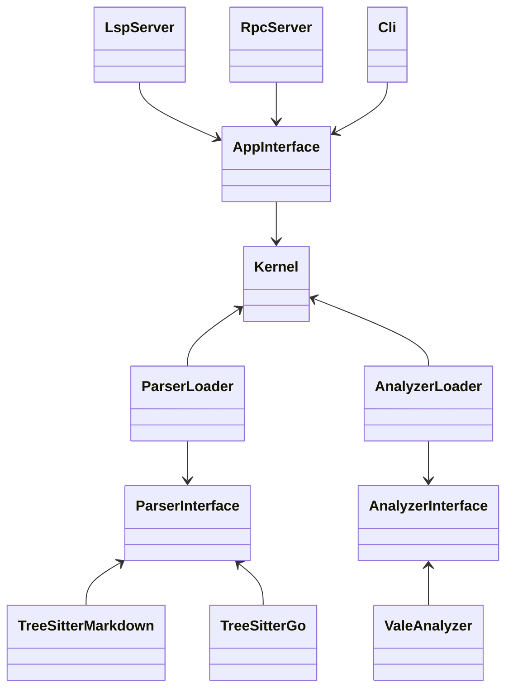

# Architecture design

## Components
Each component may consist of several packages, but there should be a clear separation between each component.

### Parser loader

This component should keep track of loaded parser modules.

### Analyzer loader

This component should keep track of loaded analyzer modules.

### Module interface

This component should provide a unified interface for modules to implement.

### Analyzer interface

This component should provide a unified interface for analyzers to implement.

### App interface

This component should provide a unified interface for apps to use, such as a RPC server, CLI, and LSP server.

### Kernel

This component glues the other components together.
It does the following things:
1. Instruct the module loader to load modules.
2. Instructs the analyzer loader to load analyzers.
3. Takes buffers from the tools and forwards them to the modules for parsing.
4. Takes the parsed buffers and sends them to the analyzers.
5. Takes the diagnostics from the analyzers and gives them back to the tools.

## Diagram

