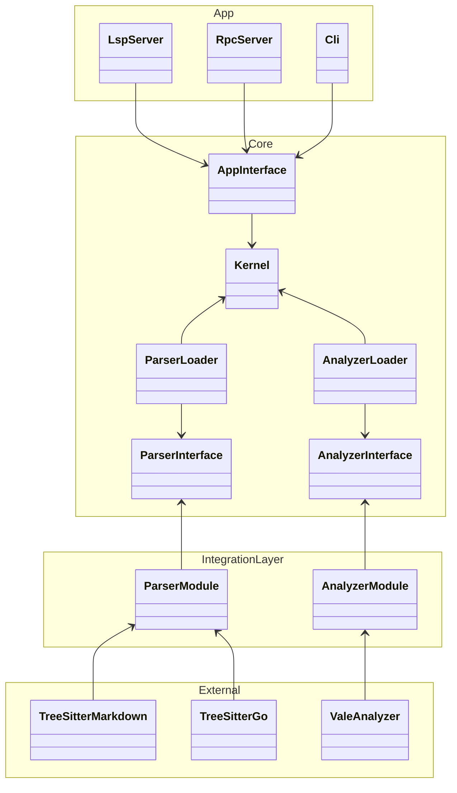

# Architecture design

Within the architecture there are several sections:
- External: Code that is created by external developers
- Core: Code that is part of the core package
- Integration layer: Code that compiles into a separate library

## Components
Each component may consist of several packages, but there should be a clear separation between each component.

### Parser loader

This component should keep track of loaded parser modules.

The parser loader is part of the core.

### Analyzer loader

This component should keep track of loaded analyzer modules.

The analyzer loader is part of the core.

### Parser interface

This component should provide a unified interface for parsers to implement.

The parser interface is part of the core.

### Parser module

This component should allow external code to easily implement a parser.

The parser module is part of the integration layer.
A parser module gets compiled together with external code into a library.

### Analyzer interface

This component should provide a unified interface for analyzers to implement.

The analyzer interface is part of the core.

### Analyzer module

This component should allow external code to easily implement an analyzer.

The analyzer module is part of the integration layer.
An analyzer module gets compiled together with external code into a library.

### App interface

This component should provide a unified interface for apps to use, such as a RPC server, CLI, and LSP server.

The app interface is part of the core.

### Kernel

This component glues the other components together.
It does the following things:
1. Instruct the module loader to load modules.
2. Instructs the analyzer loader to load analyzers.
3. Takes buffers from the tools and forwards them to the modules for parsing.
4. Takes the parsed buffers and sends them to the analyzers.
5. Takes the diagnostics from the analyzers and gives them back to the tools.

The kernel is part of the core.

## Diagram

